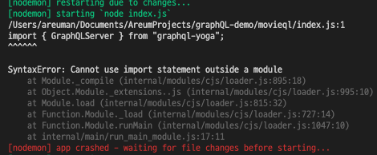

# movieql

Movie API with Graphql

## Table of Contents

- [movieql](#movieql)
  - [Table of Contents](#table-of-contents)
  - [Intro](#intro)
  - [Set up](#set-up)
    - [graphQL](#graphql)
    - [babel-node](#babel-node)
  - [reference](#reference)

## Intro

Learning graphQL with small example.

## Set up

### graphQL

```
yarn init v1.19.2
question name (movieql):
question version (1.0.0):
question description: Movie API with Graphql
question entry point (index.js):
question repository url: https://github.com/AreumAn/movieql
question author: Areum An<areum.an.0928@gmail.com>
question license (MIT):
question private:
success Saved package.json
✨  Done in 186.08s.
```

- install `graphql-yoga`

  ```
  yarn add graphql-yoga
  ```

- install `nodemon`: if you didn't install before

```
yarn global add nodemon
```

- To restart when change the file. Update `pakage.json`

  ```
  "scripts": {
    "start": "nodemon"
  }
  ```

### babel-node

To use `import`, install `babel-node`. Otherwise, you need to use `require`. If you don't, you will get error.



```
yarn global add babel-cli --ignore-engines
```

- update `pakage.json`

```
"scripts": {
    "start": "nodemon --exec babel-node index.js"
  }
```

- create `.babelrc` setting file

```
 {

"presets": ["env", "stage-3"]

}
```

- install

```
yarn add babel-cli babel-preset-env babel-preset-stage-3 --dev
```

## reference

- [GraphQL로 영화 API 만들기](https://academy.nomadcoders.co/courses/enrolled/357405)
